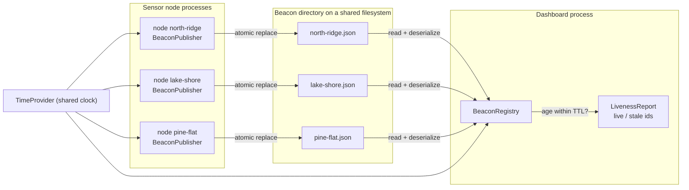
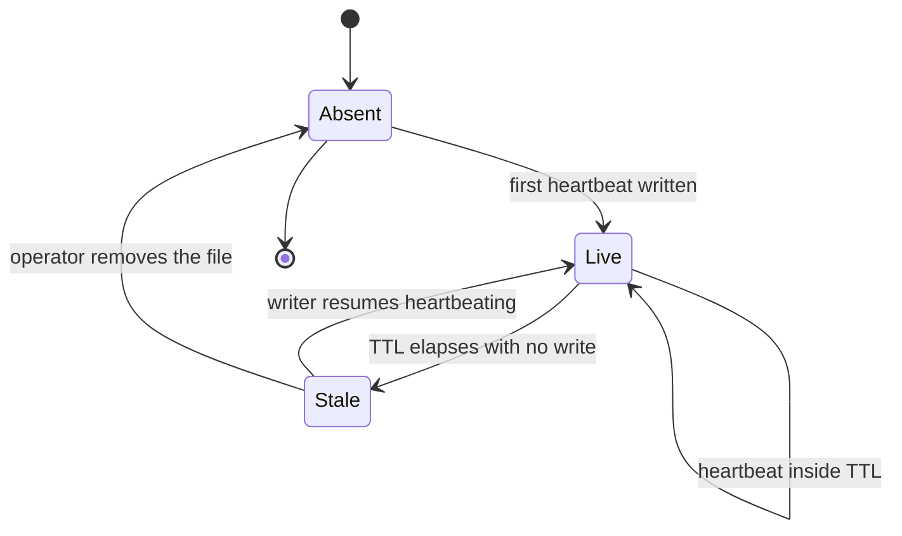
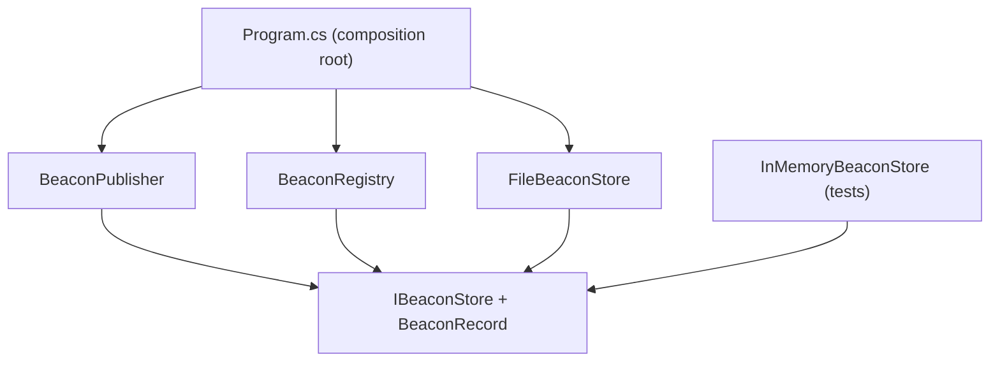

# 02 — Architecture

This section exists to show you the moving parts before you read any code. The presence-beacon pattern is small enough that its whole architecture fits on one page, but the parts have to be split along the right seams: a write side that knows about exactly one harness, a read side that knows about all of them, a storage seam you can swap, and a clock you can control from a test. Once you can name those four seams, the walkthrough in `03-walkthrough.md` is just detail.

## The shape in one picture

The demo models a weather station: three sensor nodes invent temperature readings, and a dashboard answers "which nodes are live right now?" Each node writes its own beacon file. Nobody writes anybody else's.

Read it left to right: writers fan in to a directory, the directory fans in to one reader, and the same clock feeds both sides. The arrows are one-directional on purpose — there is no callback, no notification, and no handshake. A reader learns about a writer only by finding its file.

## The four seams

### 1. `BeaconRecord` — the payload

An immutable record with four members: the harness id, the last-seen timestamp in UTC, an optional free-text task hint, and the TTL in minutes. Two properties matter more than they look:

- **TTL travels with the beacon, not with the reader.** A slow node that heartbeats every 60 seconds can declare a 5-minute TTL while a chatty node declares 30 seconds, and the reader honors both without configuration. The reader's only job is comparing an age to a number it was handed.
- **The timestamp is UTC, always.** Beacons cross process boundaries and, on a shared filesystem, possibly machine boundaries. Local time in a serialized heartbeat is a bug waiting for a daylight-saving transition.

Serialization is `System.Text.Json` through a source-generated context, so the demo has no reflection-based JSON on the hot path and stays trim-friendly.

### 2. `IBeaconStore` — the storage seam

Two methods, deliberately asymmetric:

| Method | Scope | Why the asymmetry |
|---|---|---|
| `WriteAsync(BeaconRecord, CancellationToken)` | One harness | A writer only ever knows itself |
| `ReadAllAsync(CancellationToken)` | Every harness | A reader only ever wants the whole set |

That asymmetry is the invariant "writers never delete other harnesses' beacon files" expressed in a type. There is no `Delete(harnessId)` on the interface, so no writer can reach a neighbor's file through the abstraction at all.

`FileBeaconStore` is the production implementation. Its write is a two-step atomic replace:

1. Serialize to a sibling temp file with a unique suffix, e.g. `north-ridge.json.4f2c.tmp`.
2. Move the temp file over the final path with overwrite enabled.

The move is what buys you the "concurrent writes do not corrupt each other" invariant. A reader that opens `north-ridge.json` at any instant sees either the previous complete beacon or the next complete beacon — never a half-flushed one. Writing in place with a truncating stream would give a reader a real chance of parsing an empty or partial file, and the failure would be rare enough to survive code review and haunt you in production.

The map from harness id to file path is total and deterministic: sanitize the id, append `.json`, combine with the configured directory. One id, one path — that is the "exactly one beacon file per harness" invariant, enforced by a pure function rather than by convention.

### 3. `BeaconPublisher` — the write side

Owns a single harness id, a TTL, and an `IBeaconStore`. Its `HeartbeatAsync` stamps the current time from the injected `TimeProvider` and hands a fresh record to the store. It holds no timer of its own; the hosting code decides the cadence. That keeps the publisher trivially testable — call it, advance a fake clock, call it again — and lets a caller heartbeat opportunistically (after each unit of work) instead of on a fixed schedule.

The publisher never reads. It cannot answer "who else is live?" because it has no need to, and giving it that ability would tempt callers into treating a beacon as a lock.

### 4. `BeaconRegistry` — the read side

Takes an `IBeaconStore` and a `TimeProvider`, and returns a `LivenessReport` holding two collections: live harnesses (with their records) and stale ones (with how long they have been overdue). The rule is one line of arithmetic — a beacon is live exactly when the elapsed time since `LastSeenUtc` is at or under its TTL — and everything else in the class is about failing softly.

## Beacon lifecycle

A single beacon file moves through a small state machine. The dashboard never sees these states directly; it re-derives them from timestamps on every poll, which is why a reader can crash and restart without losing track of anything.

Note the `Stale --> Live` edge. A node that pauses past its TTL and then comes back is simply live again — there is no quarantine, no re-registration, and no epoch counter. That is a direct consequence of state living in the timestamp rather than in the reader.

## Failing soft is a design requirement

A liveness signal that throws is worse than no liveness signal, because callers wrap it in `try/catch` and then stop trusting it. The read path degrades instead:

| Condition | Behavior | Reasoning |
|---|---|---|
| Beacon directory does not exist | Empty live set | "Nobody has started yet" is a legitimate answer, not an error |
| One file fails to deserialize | Skip that file, keep the rest | A single bad beacon must not blind you to five good ones |
| One file is locked mid-read | Skip that file this round | The next poll is seconds away; treat it as momentarily absent |
| Clock skew across machines | Skewed node reads as stale early or late | Documented limit — see `04-tradeoffs.md` |
| Directory contains unrelated files | Ignored by extension filter | The directory is not assumed to be exclusively yours |

The write path is the opposite: it surfaces failures. If a node cannot write its own heartbeat, it should know, because the alternative is a process that believes it is announcing itself while the dashboard has already written it off.

## What the architecture deliberately does not have

- **No lock, lease, or claim.** Nothing in this design prevents two nodes from doing the same work. A beacon tells you who is around; it does not tell anyone to stand down. Mutual exclusion is a different pattern with a much harder correctness argument.
- **No central server or broker.** The only shared component is a directory. That is the whole point — the coordination cost is one file write and one directory listing.
- **No authentication.** A harness id is a self-asserted string. Anything that can write to the directory can claim any id. Run this inside a trust boundary.
- **No push notifications.** Readers poll. Filesystem watchers are an available optimization, not part of the core model, because a poll is idempotent and a missed watch event is not.

## Dependency direction

Dependencies point inward, and the demo entry point is the only place that knows about concrete types:

`BeaconPublisher` and `BeaconRegistry` never name `FileBeaconStore`. That is what lets the test project substitute an in-memory store and a fake `TimeProvider`, then assert the TTL boundary exactly — heartbeat, advance the clock to one tick under the TTL, assert live; advance one tick past, assert stale — with no files, no sleeping, and no flake.

Next: `03-walkthrough.md` runs the three-node demo end to end and shows what the dashboard prints when one node stops writing.
